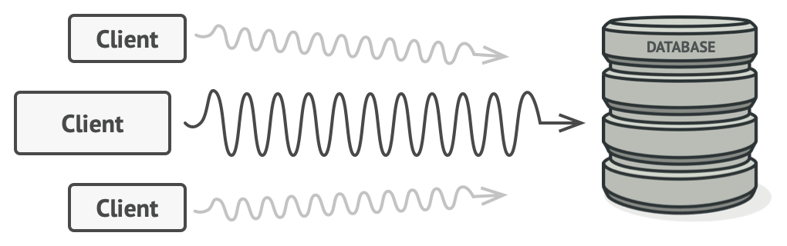
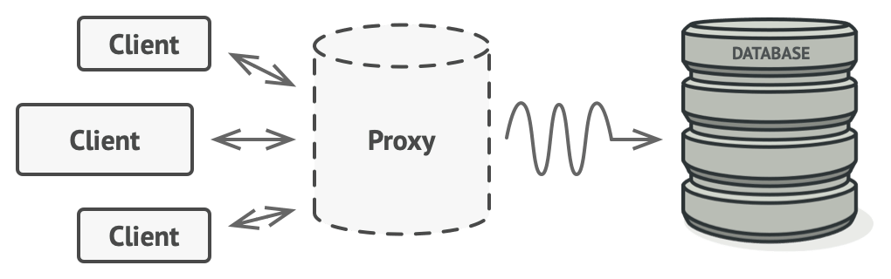

## Proxy Design Pattern Nedir ? 

Proxy Design Pattern , başka bir nesne için bir yedek veya yer tutucu sağlamanıza 
olanak tanıyan / aracı class yapısal bir tasarım modelidir.
Bir Proxy Class, Gerçek nesneye erişimi kontrol ederek, 
istek orijinal nesneye ulaşmadan önce veya
sonra bir şeyler gerçekleştirmenize izin verir.Product ve ProductProxy classların olduğunu düşünelim. Ve Productları Db’ye aktarmak istiyoruz.
- Aktarma işlemi sırasında log atmak isteyebiliriz bu log işlemini proxy classımızda yapabiliriz.
- Aktarma işlemine yeterli izni var mı bunun kontrolü için kullanılabilir.
- Ürünleri her seferinde veritabanından çekmek yerine proxy class'da cache kullanıblabilir.

## Sorun ?
Her seferinde kaynağa (veritabanı,api,...) istek atılarak çok büyük bir
yük oluşturuluyor ve sistem kaynaklarını tüketiyor.Ama aslında dönen response
çok uzun süre aralıklarla değişiyor her seferinde bu kaynağa gidilmesine
gerek yok.

## Çözüm

Proxy Design Pattern, gerçek hizmet nesnesiyle aynı arabirime 
sahip yeni bir proxy sınıfı oluşturmanızı önerir.
Ardından, proxy nesnesini orijinal nesnenin tüm 
istemcilerine iletmesi için uygulamanızı güncellersiniz.
Bir istemciden bir istek aldığında, proxy gerçek
bir hizmet nesnesi oluşturur ve tüm işi ona devreder.

 
### İkisi Arasındaki  Fark Ne  ?

Direkt olarak gerçek sınıfı çağırmak yerine proxy sınıfı çağırıyoruz.
Eğer proxy sınıftaki işlemden önce veya sonra bir işlem yapılmak isteniyorsa
örneğin log atma işlemi,
izin kontrolü, cache üzerinden verileri getirme
gibi işlemler proxy sınıfında yapılmalıdır. Böylece 
gerçek sınıfımızı bozmadan işlemlerimizi gerçekleştirebiliriz.

> source : https://refactoring.guru/design-patterns/proxy

