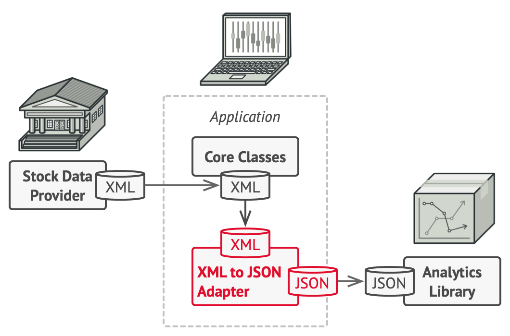

### Adapter Pattern Nedir ?
Adapter , birbirinden bağımsız nesnelerin işbirliği 
yapmasına izin veren yapısal bir tasarım desenidir.

Adapter, iki nesne arasında bir sarmalayıcı görevi görür. 
Bir nesne için yapılan çağrıları yakalar ve bunları ikinci nesne tarafından
tanınabilecek biçime ve arabirime dönüştürür

**Kullanım örnekleri**: Bağdaştırıcı deseni, PHP kodunda oldukça yaygındır.
Bazı eski kodlara dayalı sistemlerde çok sık kullanılır.
Bu gibi durumlarda Bağdaştırıcılar, eski kodun modern sınıflarla çalışmasını sağlar.

### Sorun ?
Birden fazla provider'dan ürünlerin listesini çektiğimizi düşünelim.
Ve bunları dashboard üzerinde bir Chart'da  göstermek istiyoruz.
Bu providerlardan bazıları XML dönüyor veya JSON istediğimiz formatta değil.
Burada fetch işlemi yaptıktan sonra dönen responsun değiştirilmesi gerekiyor.

Dönen XML veriyi  "olduğu gibi" kullanamazsınız çünkü bu, verilerin uygulamanızla aynı veri formatına sahip değil.

###  Çözüm

Bir adaptör oluşturabilirsiniz . Bu, bir nesnenin arayüzünü başka bir nesnenin anlayabilmesi için dönüştüren özel bir nesnedir.

Bir adaptör, sahne arkasında meydana gelen dönüştürmenin karmaşıklığını gizlemek için nesnelerden birini sarar. Sarılmış nesne, bağdaştırıcının farkında bile değildir. Örneğin, metre ve kilometre cinsinden çalışan bir nesneyi, tüm verileri fit ve mil gibi emperyal birimlere dönüştüren bir adaptörle sarabilirsiniz.

Bağdaştırıcılar, verileri yalnızca çeşitli biçimlere dönüştürmekle kalmaz, aynı zamanda farklı arabirimlere sahip nesnelerin işbirliği yapmasına da yardımcı olabilir. İşte nasıl çalıştığı:

1. Adaptör, mevcut nesnelerden biriyle uyumlu bir arabirim alır.
2. Bu arabirimi kullanarak, mevcut nesne bağdaştırıcının yöntemlerini güvenle çağırabilir.
3. Adaptör, bir çağrı aldıktan sonra isteği ikinci nesneye iletir, ancak ikinci nesnenin beklediği biçim ve sırada.

Ürünler uygulamamıza geri dönelim. Uyumsuz biçimler ikilemini çözmek için,
kodunuzun doğrudan birlikte
çalıştığı analitik kitaplığının her sınıfı için XML'den JSON'a bağdaştırıcılar 
oluşturabilirsiniz. Ardından, kodunuzu yalnızca bu adaptörler aracılığıyla kitaplıkla 
iletişim kuracak şekilde ayarlarsınız.
Bir bağdaştırıcı bir çağrı aldığında, gelen XML verilerini bir JSON yapısına çevirir
ve çağrıyı, sarılmış bir analitik nesnesinin uygun yöntemlerine iletir.

### Adapter Pattern ne zaman ihtiyaç duyarız ?

Birbirinden bağımsız nesnelerin bir arada çalışmasını istediğimiz zamanda kullanırız.

