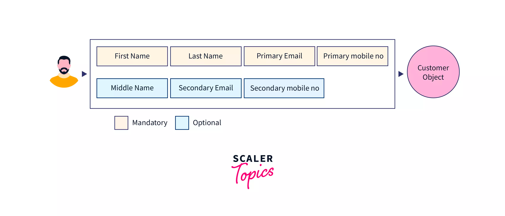
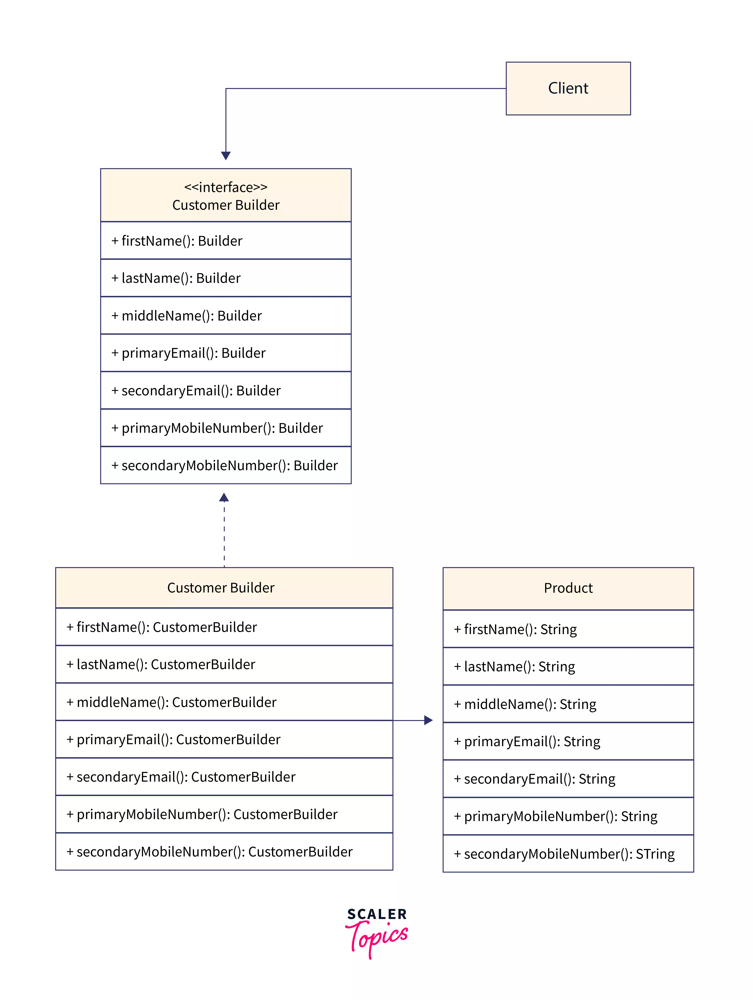

# Sorun

**Zorunlu Alanlar** 
- Ad, Soyad, Birincil E-posta ve Birincil Cep Telefonu Numarası

**İsteğe Bağlı Alanlar**
- İkinci Ad, İkincil E-posta ve İkincil Cep Telefonu Numarası

İdeal olarak, yukarıda listelenen zorunlu ve isteğe bağlı niteliklere
sahip bir Customer sınıfı oluştururuz. Yukarıdaki özellikleri kabul eden 
bir constructor oluşturuyoruz. Bazı nitelikler isteğe bağlı olduğundan,
kullanmak istemediğimiz niteliklere boş değerler iletmemiz gerekebilir.
Builder  Design Pattern deseni, tüm değerleri yapıcıya iletmeden
adım adım bir nesne oluşturmamızı sağlar.

`__construct('John','Doe',null,null,23)`

## Çözüm
Bir CustomerBuilder oluşturacağız ve onu zorunlu ve isteğe bağlı parametrelerle
müşteri nesnesini oluşturmak için kullanacağız. Son olarak,
oluşturulmuş Müşteri nesnesini elde etmek için oluşturucunun
build() yöntemini çağırıyoruz.

> Source : https://www.scaler.com/topics/design-patterns/builder-design-pattern/