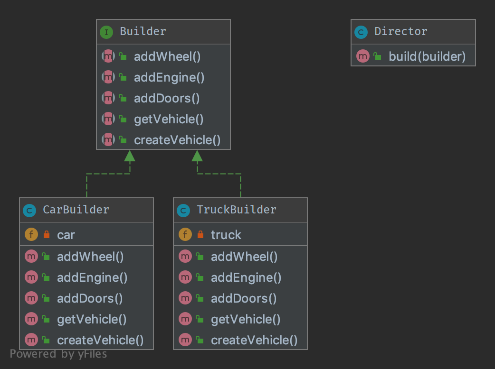

Araba Ve Tır için farklı tekerlek,motor,lastik sayısı değişken olabilir. 
Bu gibi durumlarda tek bir Builder sınıfı implemente eden Somut
sınıflar oluşturulur.

Bu Sınıflar aynı methodlara sahiptir fakat içerisi değişkendir.
Daha sonra director sınıfındaki builder method ile response/payload
build edilir.
