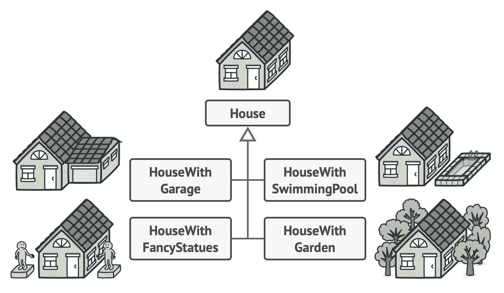
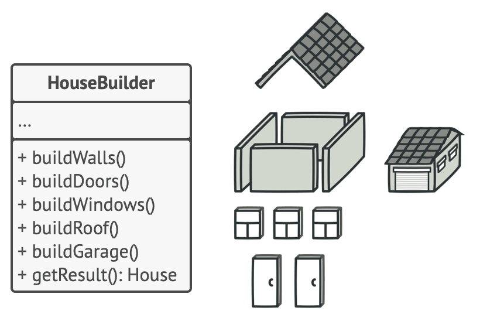
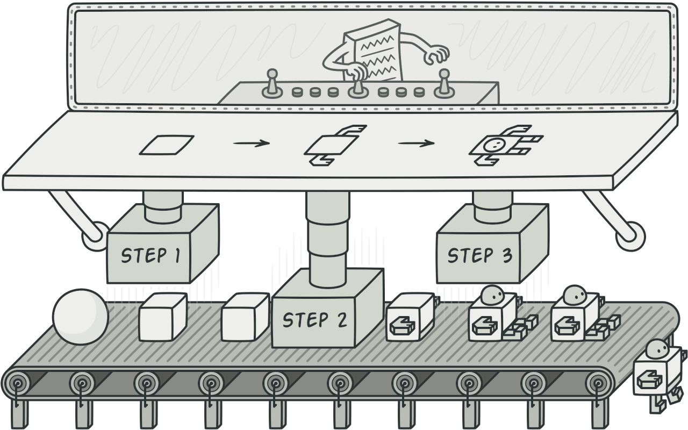

### Builder Pattern Nedir ?
Builder , karmaşık nesneleri adım adım oluşturmanıza olanak
tanıyan yaratıcı bir tasarım modelidir. Model, aynı yapı 
kodunu kullanarak bir nesnenin farklı türlerini ve temsillerini 
üretmenize olanak tanır.

#### Sorun ?
Birçok alanın ve iç içe nesnelerin zahmetli, adım adım başlatılmasını gerektiren karmaşık
bir nesne hayal edin. Bu tür başlatma kodu genellikle çok sayıda parametre içeren canavarca
bir constructor içine gömülür.
Veya daha da kötüsü: istemci kodunun her tarafına dağılmış durumda.

#### Çözüm 
Oluşturucu deseni, nesne oluşturma kodunu kendi sınıfından çıkarmanızı ve onu oluşturucu adı 
verilen ayrı nesnelere taşımanızı önerir .

### BuilderPattern'a ne zaman ihtiyaç duyarız ?
Builder Pattern kullanımı için API ve WEB için farklı
payload oluşturduğumuzu düşünelim.

Bu senaryoda bunu pattern içine taşırken parametre olarak api/web Builder Class olarak
ortam geçilir ve pattern ona göre ilgili payload oluşturur.

2 - Construct üzerinden çok fazla veri alındığında kullanilabilir.

Builder Pattern tarafından çözülen problemin tanımlanması kolaydır. Bu durumlarda kullanılmalıdır:

- Uzun bir parametre listesine sahip bir oluşturucu kullanmak gerektiğinde veya 
farklı parametrelere sahip uzun bir oluşturucu listesi olduğunda.
- Aynı nesnenin farklı temsillerini oluşturmak gerektiğinde.
Yani, farklı özelliklere sahip aynı sınıftaki nesnelere ihtiyaç duyulduğunda.

