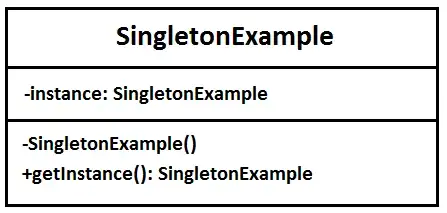

## Singleton Design Pattern Nedir ?

Singleton design pattern, creational design pattern kategorisindedir.

Bu tasarım örüntüsündeki amaç, bir class’tan sadece bir instance yaratılmasını sağlar. Yani herhangi bir class’tan bir
instance yaratılmak istendiğinde, eğer daha önce yaratılmış bir instance yoksa yeni yaratılır. Daha önce yaratılmış ise
var olan instance kullanılır.

En yaygın singleton tasarım örüntüsü örneklerinden biri Database,Logger’dır. Bir başka örnek verecek olursak DataSource
güzel bir
örnektir.

### Neden Singleton Pattern Kullanmalıyım ?

- Bir sınıfın yalnızca tek bir örneğe sahip olduğundan emin olun . Neden birisi bir sınıfın kaç örneği olduğunu
  kontrol
  etmek istesin ki? Bunun en yaygın nedeni, bir veritabanı veya dosya gibi bazı paylaşılan kaynaklara erişimi kontrol
  etmektir.Bir instance‘a kontrollü erişim sağlanır.

- Global değişkenler yaratmaktan kaçınırız.
- Singleton deseni aynı global değişkenlerde olduğu gibi nesneye istediğiniz yerde ulaşabilmesinizi sağlar ve aynı
  zamanda başka bir kodun nesnenizin üzerine yazmasını da engeller.

Singleton Pattern bize global bir erişim noktası sunar , global değişkenler gibi dezavantajı yoktur. Bu dezavantajlardan
biri şudur : objemizi global değişken olarak yarattığımızda uygulama başladığında nesne yaratılacak, bu nesne kaynak
yoğunsa ve uygulamanız onu kullanmadan tamamlandıysa ne olacak? Singleton Pattern’de bir object ancak ona ihtiyaç
duyduğumuzda yaratılır.

### Uygulanabilirlik

Programınızda kullandığınız bir sınıfın tüm istemcilerin kullanabileceği sadece tek bir örneğinin olması için singleton
desenini kullanabilirsiniz; örneğin bir programın farkı bölümlerinde kullanılan bir veritabanı nesnesi.

Singleton deseni kendi özel oluşturma metodu dışında nesne oluşturulasını engeller. Bu özel meto daha önce oluşturulmuş
bir nesne varsa onu, yoksa yeni oluşturacacağı nesneyi döndürür.
___
Global değişkenler üzerinde daha sıkı bir kontrole ihtiyacınız olduğunda singleton desenini kullanın.

Global değişkenlerin aksine Singleton deseni bir sınıfın her zaman tek bir örneğini olmasını garanti eder. Singleton
sınıfının kendisi dışında hiç bir şey önbellekteki örneği değiştiremez.
