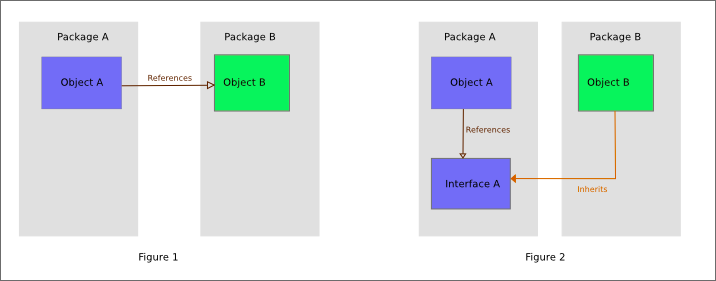
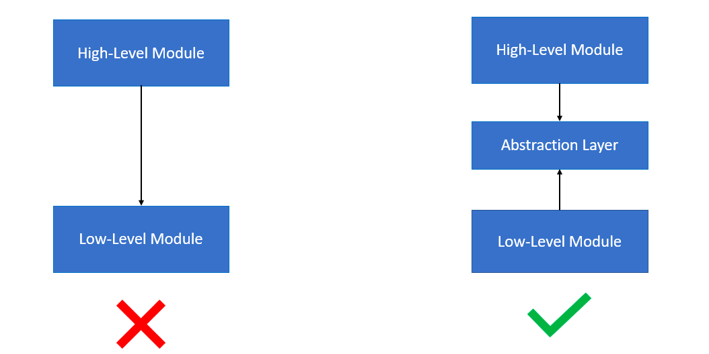

## Dependency Inversion Prensibi Nedir ?

Sınıflar arası bağımlılıklar olabildiğince az olmalıdır özellikle **üst seviye sınıflar** alt seviye sınıflara bağımlı
olmamalıdır.

Bir sınıfın, metodun ya da özelliğin, onu kullanan diğer sınıflara karşı olan bağımlılığı en aza indirgenmelidir. **Bir
alt sınıfta yapılan değişiklikler üst sınıfları etkilememelidir**.


Yüksek seviye sınıflarda bir davranış değiştiğinde, alt seviye davranışların bu değişime uyum sağlaması gerekir. Ancak,
düşük seviye sınıflarda bir davranış değiştiğinde, üst seviye sınıfların davranışında bir bozulma meydana gelmemelidir.

**Çözüm:**

Peki, bütün bu sorunlardan kurtulmanın yolu nedir ?
Cevap: Dependency Inversion, yani üst sınıflar, alt seviyeli sınıflara bağlı olmamalı, çözüm ise her ikisi de soyut
kavramlar üzerinden yönetilebilmelidir. Yüksek seviye ve düşük seviye sınıflar arasında bir soyutlama katmanı
oluşturabiliriz.

#### === Üst Seviye Sınıflar -> Soyutlama Katmanı -> Düşük Seviye Sınıfları



### Örnek Problem

Bir Notification sınıfımız olduğunu düşünelim ve bu sınıf aeracılığıyla Email ve Sms gönderebilelim.
Email gönderme işlemini yapabilen bir sınıfımız.

```
public class Email {

    public void sendEmail() {
        //Send emeail
    }
}
```

**Sms gönderebilen sınıfımız.**

```
public class SMS {
    public void sendSMS() {
        //Send sms
    }
}
```

ve bildirim göndereceğimizde ikisinide çalıştırmak amacıyla oluşturduğumuz bir Notification sınıfımız olmuş oldu.

```
public class Notification {

    private Email email = new Email();
    private SMS sms = new SMS();

    public void sender() {

        email.sendEmail();
        sms.sendSMS();
    }

}
```

Çok kötü gözükmeyen sınıflarımız var olmasına rağmen dikkat etmemiz gereken önemli bir nokta daha var. Notification
sınıfımız yüksek seviye bir sınıf olmasına rağmen daha düşük seviyeli olan Email ve SMS sınıflarına bağımlı halde. Sms
ve Email sınıflarında yada metodlarındaki değişimler direkt olarak notification sınıfını da etkileyecektir. Yeni bir
module eklendiğinde de notification sınıfımızda değişiklik yapmak zorunda kalacağız. Bu durumda Dependency Inversion
prensibine aykırı hareket etmiş olduk.

### Çözüm :

Notification sınıfını sms ve email sınıfına bağımlılığını ortadan kaldırmak için bir soyutlama yapmalıyız. Bu çözümü
uygulamak için Email ve Sms sınıflarınıda içeren bir interface yazarak başlayabiliriz.

```
public interface Message {
    void sendMessage();
}
```

Email sınıfı ise Message sınıfını implement etmektedir.

```
public class Email implements Message {

    @Override
    public void sendMessage() {
        // send email to user
    }
}
```

Aynı şekilde Sms sınıfını da Message sınıfından implement edeceğiz.

```
public class SMS implements Message {

    @Override
    public void sendMessage() {
        // Send sms logic
    }
}
```

Ve son olarak sıra, Notification classımızı yazmakta;

```
public class Notification {

    private List<Message> messages;

    public Notification(List<Message> messages) {
        this.messages = messages;
    }

    public void sender() {
        for (Message message : messages) {
            message.sendMessage();
        }
    }
}
```

Artık email ve sms sınıflarıyla doğrudan bağlantılı olmayan ve soyut olarak tanımladığımız Message arayüzünü kullanan
bir yapı haline getirdik. Yüksek seviye bir sınıfın alt seviye sınıflara olan bağımlılığını ortadan kaldırarak artık
soyut katman üzerinden işlemleri yapabiliyoruz. Dependency Inversion prensibine uygun hale getirdiğimiz yapı ile
birlikte, bağımlılıkları giderdik. Böylece Message sınıfı implement edilen yeni bir sınıfı Notification sınfıında
değişiklik yapmadan kullanabileceğiz.