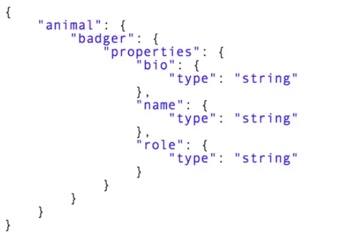
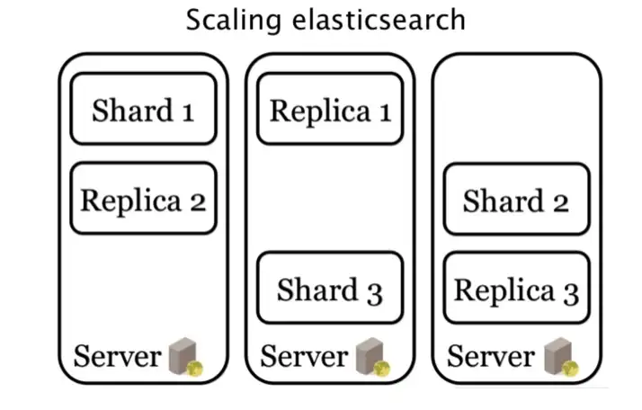

## ElasticSearch Nedir ?

Elasticsearch ; text üzerinden doğrudan arama yapmak yerine, indexler üzerinden arama yapar ve çok hızlı bir şekilde
sonuçlar üretir. Bunun yanında sorgular üzerinde istatiksel analizler , skorlamalar da yapabilir

Elasticsearch bileşenlerine ve temel prensiplerine değinelim;

|**Elasticsearch**   | **RDBMS**    |
|---|----------|
|Cluster   | Database |
|Shard   | Shard    |
|Index   | Table    |
|Field   | Column   |
|Document   | Row      |
### Indice

Yukarıda görüldüğü üzerine klasik ilişkisel veritabanlarında Database’lerin yerine Elasticsearch’te Indice kavramları
kullanılmakta.
Bir Elasticsearch Cluster’ı birden fazla indices(veritabanları) bulundurabilir.

### Type

İlişkisel veritabanlarındaki tablolar için ES “Type” kavramını kullanır. Bir indice, birden fazla type(tablo)
barındırabilir.

### Document

Elasticsearch’te, ilişkisel veritabanlarındaki Rows (satılar), Documents (Dökümanlar) olarak temsil edilirler. Her type,
birden fazla document’a sahiptir.

### Field

Klasik veritabanlarındaki Column’lar, Elasticsearch’te Field(Alan/kolon) olarak nitelendirilir. Her document bir den
fazla fileld’a sahiptir.

### Full-text search (Tam metin arama)

Herhangi bir kaynaktan alınan metin belgeleri içinden, herhangi bir anahtar kelimenin aratılarak, anahtar kelime ile
eşleşen dökümanların bulduğu sonuca hızlı şekilde erişime verilen isimdir.

Örneğin, wikipedia.com‘da bir bilim adamının ismini aratıp bununla ilgili yazılan yazıları okuyacağınızı varsayalım.
Wikipedia’nın arama çubuğuna Nicola Tesla yazdığınızda onunla ilgili yazıları bulmak için kayıtlı tüm yazılarda arama
yapmak yerine, önceden indekslenmiş veriler içinden Nikola Tesla’nın adının geçtiği metinlerin olduğu index’e hemen
gidip hızlıca size sonuç döndürmeyi sağlayan yapıdır.

### Index

Elasticsearch’e eklenen her kayıt JSON belgesi olarak yapılandırılır. Yani, dökümanlarınızın içindeki her bir kelime(
terim) için hangi döküman yada dökümanlarda o kelimenin olduğu bilgisini tutan bir endeksleme sistemi vardır. Bir nevi
veritabanı gibi düşünebilirsin. Veritabanındaki verilerde olan düzen gibi, Elasticsearch’ün indexleri de JSON formatı
şeklinde düzenlidir.

### Mapping

Verileri indexlerken bu verilerin hangi tipte olduğunu göstermemiz gerekir. Yani bir kelimeyi indexlerken o kelimenin
hangi veri tipinde(string, integer, boolean) olduğu bilgisinin tanımlandığı işlemdir.

### RestfullAPI

REST, istemci-sunucu iletişimi ile ilgili bir mimari. Restfull servisler, istemci-sunucu arasında bir çok farklı tipte
yanıt(response) dönebilirler (JSON, XML, CSV, HTTP). RestfullAPI ise bu servisleri kullanan bir API.

### Near Realtime (Yakın gerçerk zamanlı)

Elasticsearch gerçek zamana yakın bir hızla çalışır. Gerçek zamanlı yerine “yakın gerçek zamanlı” denmesindeki sebep,
bir dökümanı, gerçek zamandan çok az farklı bir gecikme süresi ile indexlemesi. (Bu süre genelde bir saniyelik bir
gecikme oluyor.)

### Cluster

Tüm verilerinizi bir arada tutan ve tüm indexleme ve arama yeteneklerinin yürütüldüğü birden çok Node’dan oluşan bir
küme veya node koleksiyonu şeklinde adlandırılabilir.

Bir küme, varsayılan olarak “elasticsearch” şeklinde benzersiz bir adla tanımlanır Bu isimlendirme isteğe bağlı olarak
değiştirilebilir. İsimlendirmeler önemlidir çünkü bir node yalnızca bir cluster’ın parçası olabilir. Node, cluster
adıyla kümeye katılmak için ayarlanmışsa bu isim tanımlamalarının doğruluğuna ihtiyaç olacaktır.

### Node

Tek bir server’a verilen isimdir. Verilerin depolandığı makinelerin her biridir. Cluster’ların indexleme ve arama
yetenekleri bu node’lar sayesinde gerçekleşir. Cluster’lardaki isimlendirme mantığındaki gibi node’lara da başlangıçta
benzersiz bir id atanır (Universally Unique IDentifier (UUID)).

Bu isimlendirmeler, nodelar arasındaki bilgi alışverişinin yönetimi için oldukça önemlidir. Eğer istenirse bu isimler de
değiştirilebilir.
Varsayılan olarak her node “elasticsearch” şeklinde isimlendirilen bir cluster’da çalışmak üzere ayarlanmıştır. Hangi
node’un hangi cluster’a gitmesini isterseniz, o cluster ismine yönlendirmelisiniz.

### Shard

Bir seferde milyonlarca dökümanı indexlemek için yeterli donanıma/server kapasitesine sahip olunmayabilir. Bir seferde
2TB lık veriyi indexlemek zorunda kaldığınızı varsayalım, bu durumda bu indexlemeyi tek bir node ile yapamak
istediğinizde, disk kapasitesinin dolması veya aşırı yavaş bir indexleme hızı ile karşı karşıya kalabilirsiniz. Bunun
önüne geçmek için Shard ve Replika kavramları bulunmakta.

Yapılacak olan bir index, bir node da yeniden shard’lara bölünür. Bu shardları arzunuza göre ayarlayabilmektesiniz.

Shard’lı mimarinin kullanılmasındaki temel iki amaç;

Birden fazla node üzerinde işlemleri dağıtmanızı ve paralelleştirmeyi sağlar. Böylece performans artar.
İçerik hacmini yatay olarak bölme ve ölçeklendirmeye olanak tanır.

### Replica

Shard’ın devre dışı kalması ihtimaline karşı index shard’larının bir veya birden çok kopyasının oluşturulabilmesini
sağlayan replica-shard yapısı bulunur.
Bir shard’a ait replica, aynı node’da barındırılmamalıdır. Bir node çöktüğünde o node’daki shard(lar)’ın yedeklerinin
diğer nodelarda bulunması veri kaybını önlemek için şarttır.

Shard ve Replica’ların farklı nodelara bölünmesinin örnek şeması

Elasticsearch’de Replica ve Shard’ların baştan belirlenmesi zorunluluğu yok. Ancak isteğe bağlı ayarlayabilirsiniz.

### Genel Problemler
- ReadOnly Error:
  - curl -XPUT -H "Content-Type: application/json" http://localhost:9200/_cluster/settings -d '{ "transient": { "cluster.routing.allocation.disk.threshold_enabled": false } }'
  - curl -XPUT -H "Content-Type: application/json" http://localhost:9200/_all/_settings -d '{"index.blocks.read_only_allow_delete": null}'
> Source : https://medium.com/@kdrcandogan/elasticsearch-nedir-45d237c29b26